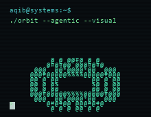

### Aaqib Zahid

`automation` &middot; `deep learning` &middot; `visual systems`  
`human-AI interfaces` &middot; `agentic tooling`

interfaces, models, and automation.

<br clear="left" />

---

### signal

```txt
automation      agents, orchestration, browser workflows
deep learning   models, representations, explanation
interfaces      HCI, visual systems, developer tools
```

### notes

Systems that make complex workflows easier to see, shape, and automate.
